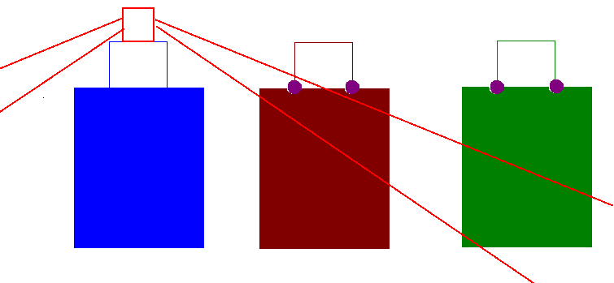
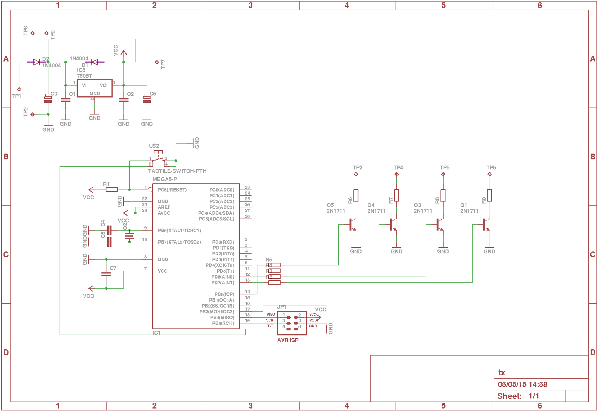

# Pourquoi une balise : #

Lors de la coupe de France de robotique, il est important de détecter le robot adverse, pour éviter de le percuter.
Après de mauvaises expériences avec les ultrasons (pas de détection du robot adverse, ou détection intempestive), nous avons décidé d'utiliser un système de détection du robot adverse plus fiable : la balise parapluie

# Fonctionnement de la balise : #

Le principe de cette balise est simple. Le schéma représente son fonctionnement (il faut me pardonner, je ne suis pas un expert de paint ...).

La balise (en rouge) posée sur le robot adverse (en bleu) créé un cône de lumière qui part du haut du robot jusqu'au sol. Lorsque notre robot est suffisamment loin du robot adverse (robot vert), le détecteur de balise (en violer) situé en haut de notre robot ne rentre pas dans le cône de lumière. Et donc, nous pouvons continuer notre petit bout de chemin.
En revanche, si nous nous rapprochons du robot adverse, nos détecteurs vont entrer dans le cône de lumière (robot rouge) et dans ce cas, nous devons éviter le robot adverse.

Tout les programmes, schémas, cartes électroniques, et plans mécaniques (STL) sont disponibles sur le dépôt github suivant : [https://github.com/gobgob/balise](https://github.com/gobgob/balise)

# Codage de l'information #

Pour éviter les fausses détections, un codage a été installé entre l'émetteur (sur le robot adverse) et le récepteur (sur notre robot). Ce codage est simple : au lieu d'éclairer en continu, la balise émet un signal à une fréquence choisie. Le récepteur lui, après application de filtre sur le signal, regarde si cette fréquence arrive. Ainsi, la lumière ambiante ne devrait pas nous perturber (en tout cas, c'est la théorie).

# Emetteur #

Pour la partie émettrice (la balise que l'on pose sur le robot adverse), l'électronique est très simple. En revanche, il y a quelques pièces mécaniques à imprimer pour avoir un bon cône de lumière.

### Mécanique ###

Les contraintes mécaniques sont simple, pouvoir intégrer un support de 8 piles AA ou d'une pile 9V, faire 8cm x 8cm x 8cm, d'avoir un interrupteur *facile* d'accès, de maintenir la carte électronique en place et d'avoir un support pour les 16 LEDs de 5mm de diamètre bien répartie.

Toute la mécanique a été fabriquée à l'imprimante 3D. Vous pouvez trouver les plans aux formats STL et solidworks sur ce lien [Plan mécanique de la balise](https://github.com/gobgob/balise/tree/master/solidworks)

### Electronique ###

Le principe est de faire clignoter rapidement les LEDs pour "coder" le signal à une fréquence donné. Pour cela, un NE555 aurait pu faire l'affaire, mais pour pouvoir choisir la fréquence facilement et de manière précise, le choix a été de mettre un microcontrôleur (ATmega328p).

Les 16 LEDs ([Datasheet](OSR5CA5111A.pdf)) ne sont pas représentées sur le schéma. Elles sont montées en série (4 LEDs avec une résistance visible sur le schéma) et commandé par un transistor (2N1711 ou 2N2222). Ce qui est important, c'est d'avoir des LEDs haute luminosité (ici, ceux sont des 30000 mcd acheté sur ebay par paquet de 100).

### Programmation  ###

Il s'agit simplement d'un programme qui doit faire clignoter les LED à une fréquence bien définie (dans notre cas, 1464Hz).

Une petite *subtilité* a été ajoutée : nous n'allumons pas les LEDs toutes en même temps, mais chacune leur tour (par série de 4). Ainsi, les LEDs sont allumé un quart de période, et il y a toujours une série de LED allumé. Cela permet de régulé la consommation de courant électrique (probablement inutile vu la faible consommation des LEDs, mais c'est fun).

Le programme est disponible [ici](https://github.com/gobgob/balise/tree/master/transmitter)

# Récepteur #

Cette partie est uniquement constitué d'électronique et de programmation. Il n'y a pas de mécanique, et il faut faire rentrer (comme on peut) les cartes électroniques dans le robot :)

Au début, pour "décoder" le signal et savoir si la fréquence choisie à l'émetteur était présente, nous avons testé des filtres. Et malgré plusieurs nuits blanches, cela n'a pas fonctionné. Les filtres auto-oscillaient ou ne fonctionnaient pas, etc ... (et pourtant, j'ai fait et refait les calculs plein de fois, et tout était bon). Plutôt  que de s'acharner sur les filtres analogiques, j'ai choisi l'option Fourier et filtre numérique.

### Electronique ###

Le fait d'avoir un système filtre numérique simplifie grandement l'électronique.

Le schéma commence avec l'ampli-op IC2 pour créer une masse virtuel (via le pont diviseur de tension R1 et R2).

Ensuite, nous avons une chaine d'amplification complète constituée :

* Un suiveur pour adapter l'impédance entre le capteur (la même LED que l'émetteur) et le reste du circuit (IC1A).
* Un filtre pour couper la partie continue du signal et garder que les variations de tension (condensateur C5).
* Un premier amplificateur de 470 environ (IC1B, R4 et R5).
* Un filtre passe bas de fréquence de coupure d'environ 30kHz (ICA3, R6, C8).
* Un dernier amplificateur réglable (IC3B et R3)
* Enfin, un pont diviseur de tension pour rendre le signal allant de 0 à 12V en sorti de l'ampli-op (par rapport à la vrai masse) à des tensions comprises entre 0 et 5V.

Et cette sortie rentre directement dans l'entrée analogique d'un arduino.

Pour résumer le schéma électronique, il y a juste une série d'amplificateur et filtre simple (coupé la composante continue et les signaux trop haute fréquence) avant d'envoyer le signal dans l'entrée analogique d'un arduino.

Dans les tests en atelier, le signal après amplification (avant d'entrée dans le microcontrôleur) est soit :

* Un créneau saturé à 30kHz (je ne sais pas pourquoi, signal parasite).
* Un créneau saturé à 30kHz et un autre saturé à 1464Hz (donc 2 signaux, donc celui que l'on veut détecter).

### La programmation ###

Voila la partie la plus intéressante de la balise.

#### Fourier ####

La transformé de Fourier permet de "transformer" un signal temporel (tension qui dépend du temps) en un signal fréquentiel (amplitude qui dépend d'une fréquence). La TFD (Transformé de Fourier Discrète) permet de faire la même chose que la transformé de Fourier en échantillonnant un signal ([voir article wikipédia sur la TFD ](http://fr.wikipedia.org/wiki/Transformation_de_Fourier_discr%C3%A8te)).

Les premiers essais de TFD ont été faits avec un tableur : Simulation d'une sinusoïde échantillonnée, calcul des coefficients de Fourier dessus, et test de changement de fréquence. Les résultats étant intéressant, l'algorithme a été implémenté sur un ATmega328p.

#### Le programme ####

Le programme est disponible sur le [github](https://github.com/gobgob/balise/tree/master/receiver). Il est constitué de plusieurs fichiers :

* tim0.c / tim0.h : Permet de configurer le timer pour générer une interruption au CAN (Convertisseur Analogique Numérique) à une fréquence de 62.5kHz
* adc.c / adc.h : Configuration du CAN pour faire une conversion à chaque fois que le Timer0 génère un overflow.
* io.c / io.h : Permet de configurer et contrôler les IO (Input Output) externe pour signaler la présence ou non de la balise, et faire du debug (ça peut toujours servir).
* sin_table.c / sin_table.h : Table de sinus et cosinus pour le calcul de la transformé de Fourier
* fft.c / fft.h : C'est dans ces fichiers que se trouve l'algorithme.
* main.c : contient le *main*, qui ne fait que comparer le résultat de la TFD avec une constante pour savoir si il y a présence du signal ou non.

##### L'échantillonnage #####

Pour échantillonner de manière régulière (c'est très important que ce soit régulier), nous utilisons le Timer 0. Lorsque celui-ci overflow, il est configurer pour lancer automatiquement une conversion Analogique Numérique. Et lorsque celle-ci est finie, elle génère une interruption pour stocker le résultat dans un tableau circulaire.

Ainsi, nous avons l'acquisition qui se fait de manière régulière (via Timer) et sans prendre du temps processeur (tout est transparent et utilise les interruptions).

##### L'algorithme #####

L'algorithme est dans la fonction fft_compute_fft. La première chose que l'on fait, c'est de copier le tableau de valeur échantillonnée (en désactivant les interruptions) pour pouvoir travailler en local sans avoir des valeurs modifiées en cours de calcul par l'échantillonnage (qui continu de fonctionner en parallèle).

Ensuite, nous appliquons la formule (en utilisant un tableau de sinus et cosinus pré-calculé).

Et on retourne le résultat (élevé au carré pour ne pas perdre de temps à calculer la racine).

##### Le *main* #####

Le programme main est très simple. On initialise tout les modules et, en boucle, on compare le résultat de notre calcul avec une valeur prédéfinie. Si on est plus grand, c'est que la fréquence pour laquelle nous avons fait le calcul est présent, sinon non. Et en fonction, on met un IO à 1 ou 0 logique pour le signaler au processeur qui contrôle le robot.

# Résultat et optimisation #

### Résultats ###

Les tests effectués à l'atelier sont concluant. Malgré la présence de bruit amplifié, on détecte bien la présence (ou pas) du signal voulu : 1464Hz.

Le calcul est un peu lent sur un ATmega (environ 10 calcul par second avec 128 points) mais suffisant pour la coupe.

Malheureusement, à cause d'un manque de temps à la coupe (petit robot à débuguer, chorégraphie à faire pour le gros robot, coupe off à préparer, etc ...), nous n'avons pas pu intégrer le module balise (fait à Montpellier) dans le robot (fait à Paris). Peut-être l'année prochaine ...

### Optimisation ###

Les premiers tests étaient extrêmement lents. L'ATmega n'aimait pas calculer autant de sinus et cosinus, donc la première optimisation a été de créer une table de sinus et cosinus pour simplifier les calculs au processeur.

On peut aussi réduire le nombre de point pour le calcul (on perd en précision, mais on gagne en temps).

Une autre optimisation consiste à changer la fréquence du quartz (overclocker l'ATmega de 16MHz à 20MHz). Ou encore mieux, passer sur un processeur 32 bits bien plus rapide (comme utiliser une teensy 3.1 ou un arduino Due).

### A venir ### 

Quelques tests on était effectué sur un arduino Due pour un autre projet. Et c'est beaucoup plus rapide (environ 250 calcul à la second pour 256 points et une fréquence d'échantillonage de 100kHz). Mais ça, c'est pour d'autres articles (TFD et projet mystère) ...